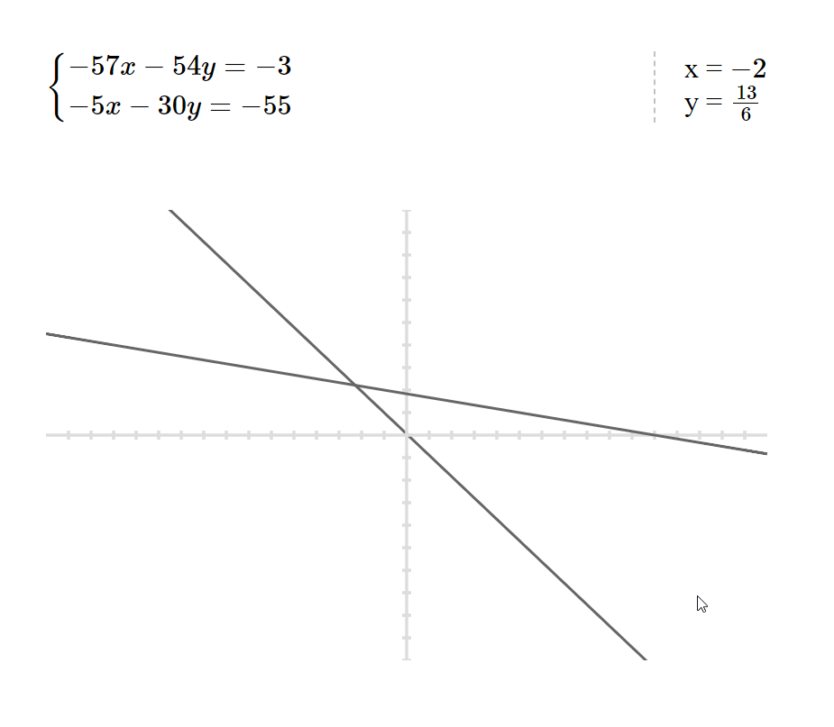

# Python web-page for generating a random system of two linear equations

> It shows the solutions, and a chart as well

## What's inside:

* [SymPy](https://www.sympy.org/en/index.html)
* [Flask](https://flask.palletsprojects.com/en/1.1.x/)
* [graph-calc](https://gist.github.com/tylerneylon/584a5e55d77372fe8ab8ddd1f1741627)
* [MathJax](https://www.mathjax.org/)

